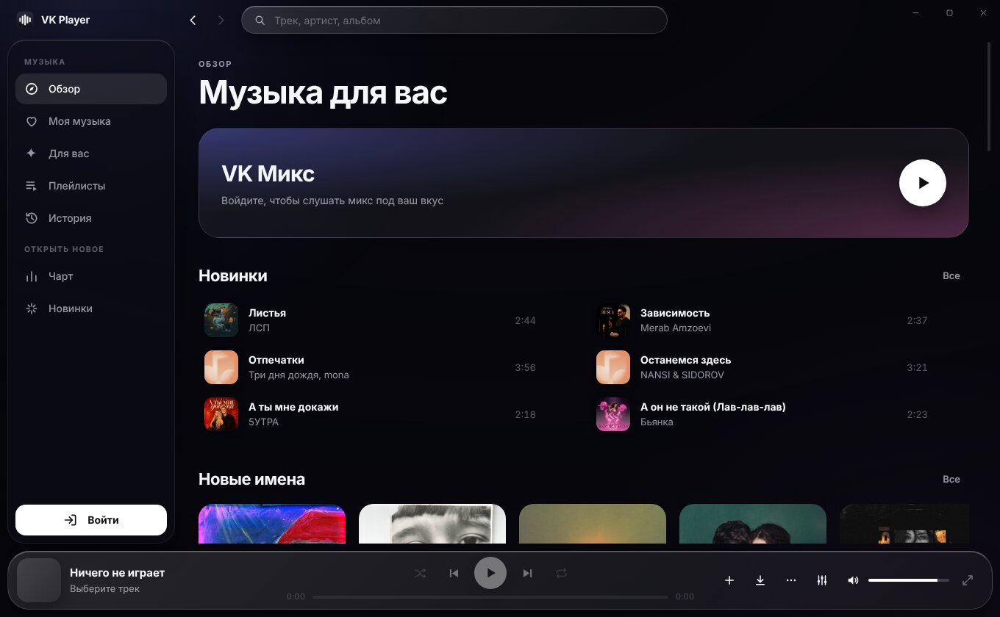
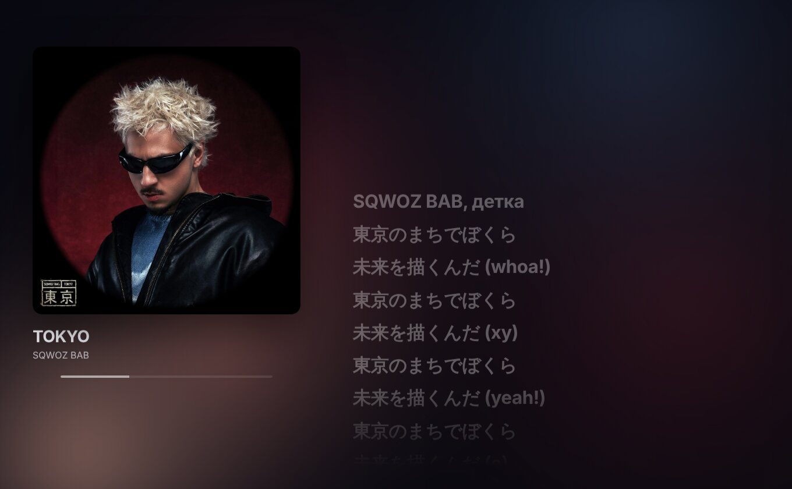
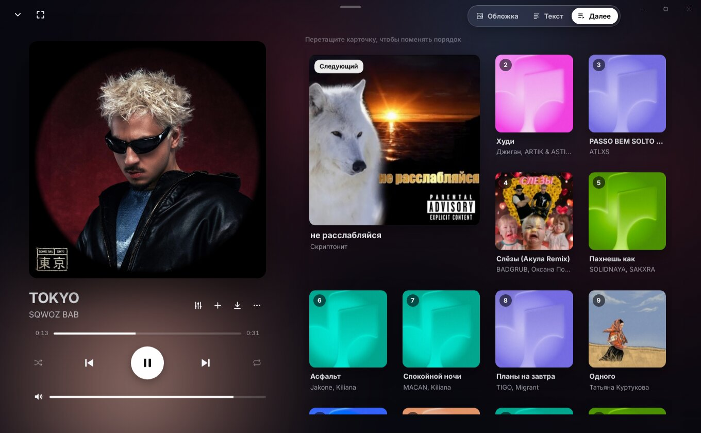
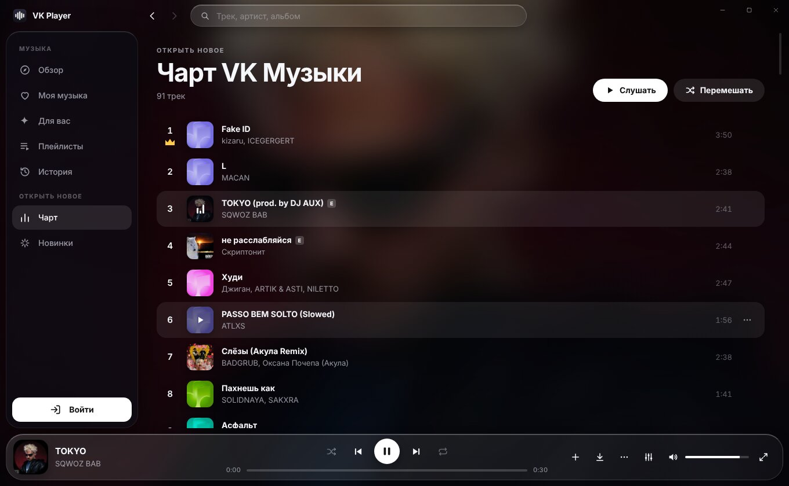

# VK Player

Десктопный плеер ВК Музыки для Windows со **своим интерфейсом** в стиле «жидкого стекла»:
живой фон из цветов обложки, полупрозрачные панели, плавные пружинные анимации.
Музыку без цензуры находит и включает сам, тексты песен подсвечивает по ходу трека,
обновляется автоматически.

**[⬇ Скачать последнюю версию](https://github.com/rex1do/vk/releases/latest)**: `VKPlayer-Setup-*.exe` (установщик, обновляется сам)
или `VKPlayer-Portable-*.exe` (без установки).



| Текст песни с подсветкой строки | Очередь «Далее» карточками |
|---|---|
|  |  |

| Чарт VK Музыки | Обложка во весь экран |
|---|---|
|  |  |

## Что умеет

- **VK Микс** — бесконечный поток музыки под ваш вкус; кнопка «Настроить»: настроение,
  узнаваемость (знакомое / незнакомое / новинки), язык (русский / иностранный / без слов);
- **Чарт VK Музыки** — актуальный чарт аккаунта с местами, лидером и движением треков;
- **Обзор, Моя музыка, Для вас, Плейлисты, Чарт, Новинки** — всё отрисовано заново, ничего от вёрстки ВК;
- **страницы артистов**: популярные треки, релизы, участие в релизах — клик по имени исполнителя
  в любом месте: в списках, в поиске, в плеере и полноэкранном режиме;
- **поиск с подсказками**: при вводе — артисты и треки, Enter — полные результаты;
- **свой плеер**: очередь, перемешивание, повтор (очередь / трек), перемотка, громкость;
  музыка не прерывается при поиске и переходах между разделами, следующий трек включается сам;
- **полноэкранный режим** (клик по треку внизу или ⤢) с тремя видами: «Обложка» — крупная
  обложка на живом фоне из её цветов, «Текст» — текст песни с подсветкой текущей строки
  (клик — перемотка), «Далее» — очередь карточками, которые можно перетаскивать;
  через 5 секунд без движения мыши кнопки прячутся, а обложка плавно увеличивается;
  жесты на обложке: колесо — громкость, потянуть вбок — перемотка, вниз — свернуть,
  двойной клик — в «Мои аудио»;
- **плавные переходы** между треками (кроссфейд, длительность настраивается);
- **DJ-сет** (кнопка «DJ-микс» у «Моих треков» или «Переходы → DJ-сет» в панели эквалайзера): следующий трек подбирается
  по темпу (BPM) и тональности (круг Камелота), а переход сводится как на диджейском сете —
  темп нового трека подгоняется под текущий, доли совпадают, на сильной доле бас переходит
  к новому треку, старый уходит с фильтром; потом темп плавно возвращается к родному;
- **альбом или плейлист как DJ-сет** (кнопка «DJ-сет» рядом со «Слушать»): треки идут по порядку,
  без длинных вступлений и концовок, со сведением в такт — даже если переходы в настройках выключены;
- **перемешать всё** — вся библиотека «Мои аудио» сразу; **история прослушиваний**;
- **тексты**: из ВКонтакте, затем из открытой базы LRCLIB (часто с привязкой ко времени), затем с Genius;
- **добавить в Мои аудио** (＋) и **скачать трек** (↓) — MP3 с названием, исполнителем и обложкой;
- **эквалайзер** на 10 полос с пресетами (Бас, Поп, Рок, Хип-хоп, Электроника, Вокал, Акустика, Ночь);
- **без цензуры** (включено по умолчанию, выключается в панели эквалайзера): если лицензионный трек
  зацензурен, играет копия без цензуры, загруженная во ВКонтакте. Копии ищутся по исполнителю и названию
  (приписки в скобках допускаются, ремиксы, slowed, nightcore, bass boost отсекаются) и проверяются по самой
  звуковой волне: та же запись, совпадающая везде, кроме мест цензуры. Сдвиг начала до 12 с не мешает.
  В окне подробностей видно все найденные копии — любую можно включить вручную с того же места;
- **меню ⋯ у каждого трека** (и правый клик): играть следующим, добавить/удалить из Моих аудио,
  скачать, найти похожие, перейти к артисту, текст на Genius;
- **режим «только плеер»** (⛶ в полноэкранном плеере или F11) — плеер на весь экран без остального;
- адаптивность: на узком окне меню сворачивается в иконки, панель плеера становится компактной;
- трей (крестик сворачивает, музыка играет), медиаклавиши и системная плашка Windows;
- учитываются системные настройки «уменьшить анимацию» и «уменьшить прозрачность».

Горячие клавиши: `Пробел` — пауза, `←/→` — перемотка на 5 с, `Ctrl+F` — поиск,
`Alt+←/→` — назад/вперёд, `Esc` — свернуть полноэкранный плеер, `Ctrl+Q` — выход.

## Безопасность аккаунта

Вход — на официальной странице ВК (показывается внутри окна только в момент входа).
Данные берутся через API **веб-версии ВК** (`web.api.vk.ru`, клиент самого сайта vk.com):
запросы выполняются внутри невидимой официальной страницы vk.com с её же токеном — для ВК это
те же запросы, что делает сайт. Неофициальных клиентов и чужих токенов (Kate Mobile и т.п.),
за которые ВК замораживает аккаунты, нет.

Без входа доступны обзор, чарт и новинки (ВК даёт только 30-секундные фрагменты);
поиск, «Моя музыка», «Для вас» и плейлисты — после входа.

## Установка (Windows)

Страница [Releases](https://github.com/rex1do/vk/releases/latest): `VKPlayer-Setup-*.exe`
(установщик) или `VKPlayer-Portable-*.exe` (без установки). Каждая сборка из ветки `main`
публикуется как релиз автоматически.

## Разработка

```
npm install
npm start          # запустить
npm run dist       # собрать exe в dist/
```

`main.js` — окно, вход, запросы к API; `shell/` — интерфейс и плеер (`app.js`, `shell.css`).
Дизайн-принципы — в `.claude/skills/apple-design` (скилл Emil Kowalski, MIT).

## Обновления

Установленная версия (VKPlayer-Setup) при запуске проверяет релизы на GitHub, скачивает
обновление в фоне и предлагает перезапуститься; иначе оно установится при выходе из программы.
Переносная версия (Portable) только сообщает о новой версии и открывает страницу загрузки.
